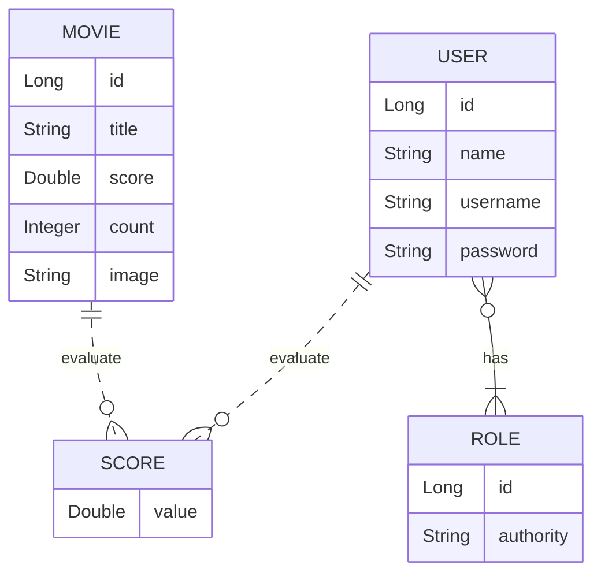

# CHALLENGE DS-MOVIE REST-ASSURED
📓 DevSuperior / Java Spring Expert / Test de API com MockMvc e RestAssured 
📅 January 29, 2024 - 📍 São Paulo, Brazil 

## Versões
- Java 17
- Maven 3.x
- Spring 3
- Rest Assured 5.2.1

## Projeto
Este é um projeto de filmes e avaliações de filmes. A visualização dos dados dos filmes é pública (não necessita login),
porém as alterações de filmes (inserir, atualizar, deletar) são permitidas apenas para usuários ADMIN. As avaliações de
filmes podem ser registradas por qualquer usuário logado CLIENT ou ADMIN. A entidade Score armazena uma nota de 0 a 5
(score) que cada usuário deu a cada filme. Sempre que um usuário registra uma nota, o sistema calcula a média das notas
de todos usuários, e armazena essa nota média (score) na entidade Movie, juntamente com a contagem de votos (count).

## Entidades

## Testes Realizados

- **MovieContollerRA:**
  - findAllShouldReturnOkWhenMovieNoArgumentsGiven 
  - findAllShouldReturnPagedMoviesWhenMovieTitleParamIsNotEmpty 
  - findByIdShouldReturnMovieWhenIdExists 
  - findByIdShouldReturnNotFoundWhenIdDoesNotExist 
  - insertShouldReturnUnprocessableEntityWhenAdminLoggedAndBlankTitle 
  - insertShouldReturnForbiddenWhenClientLogged 
  - insertShouldReturnUnauthorizedWhenInvalidToken
- **ScoreContollerRA:**
  - saveScoreShouldReturnNotFoundWhenMovieIdDoesNotExist 
  - saveScoreShouldReturnUnprocessableEntityWhenMissingMovieId 
  - saveScoreShouldReturnUnprocessableEntityWhenScoreIsLessThanZero
